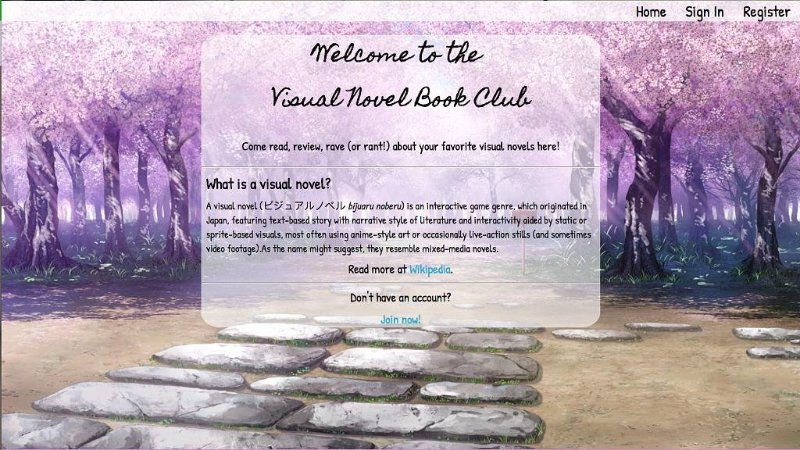
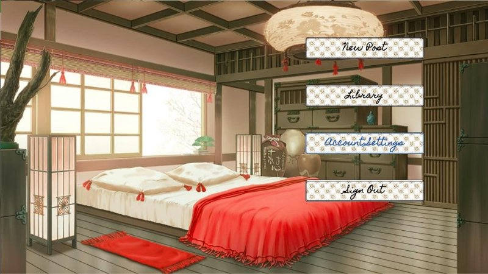
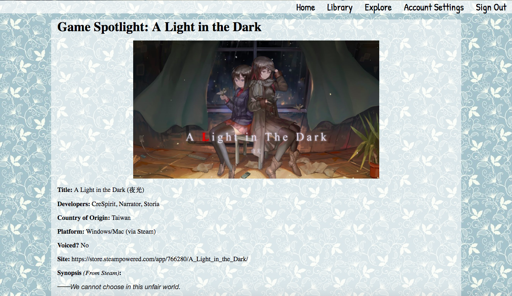

# R-umblr

## Goal:
To create a fullstack simple blog website that enables someone to sign up for an account and create relevant posts on a topic of their choosing.

## Blog Summary:
The Visual Novel Bookclub is a blog designed for fans of visual novel games to talk about their favorite games (whether that be to review, rave, or rant about them) and to learn about other titles. As it is a game-based blogging site, the Visual Novel Bookclub was designed to resemble an actual visual novel game, with the background images being actual images designed for visual novel games and a user home page reminiscent of a game menu. 

Currently users are able to perform basic functions, such as registering for an account, signing in and out, creating a blog post when signed in, seeing their previous posts, seeing other users' posts, and deleting their account.

## Built Using:
* Sinatra
* ActiveRecord
* PostgreSQL
* TinyMCE (https://www.tiny.cloud/)
* Animate.css
* HTML
* SCSS

    

    
